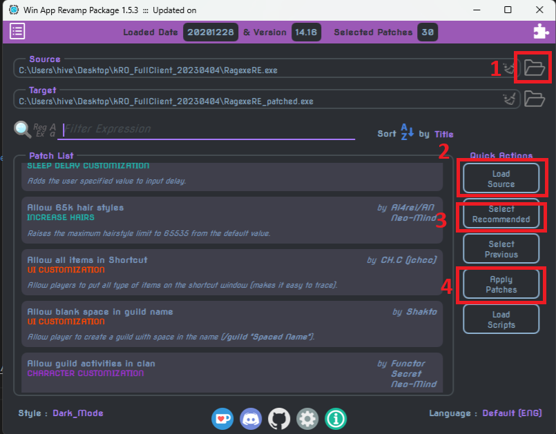

# rAthena

Forked from [rathena](https://github.com/rathena/rathena)

# Starting Server

See [./tools/docker/README.md](./tools/docker/README.md) for full instructions on building, starting, and modifying packet version.
If you make code changes or would like to target a different `PACKETVER`, make sure to delete the `char-server`, `login-server`, and `map-server` binaries in the root of the repo.

## Pre-requisites

1. [Docker](https://docs.docker.com/)
1. [Docker Compose](https://docs.docker.com/compose/)

## Client modifications

### Server connection

1. Download [kRO_FulClient_20230404](https://mega.nz/folder/jUsDgRxQ#ttLmLjPY9p9cfU5_ShWVCw) ([source](https://rathena.org/board/topic/106413-kro-full-client-2023-04-04-includes-bgm-rsu/))
1. Using [GRF Editor](https://rathena.org/board/files/file/2766-grf-editor/), create a new GRF.
   1. Inside the GRF, create a file at `data/sclientinfo.xml`. Using the template below as a base, update the `address` and `port` to match those of your `login-server`.
      ```xml
          <?xml version="1.0" encoding="euc-kr" ?>
          <clientinfo>
              <desc>Ragnarok Client Information</desc>
              <servicetype>korea</servicetype>
              <servertype>primary</servertype>
              <connection>
                  <display>My Custom Server</display>
                  <address>127.0.0.1</address>
                  <port>6900</port>
                  <version>55</version>
                  <langtype>0</langtype>
                  <registrationweb>www.ragnarok.com</registrationweb>
                  <loading>
                      <image>loading00.jpg</image>
                      <image>loading01.jpg</image>
                      <image>loading02.jpg</image>
                      <image>loading03.jpg</image>
                      <image>loading04.jpg</image>
                      <image>loading05.jpg</image>
                      <image>loading06.jpg</image>
                  </loading>
                  <aid>
                      <admin>2000000</admin>
                  </aid>
              </connection>
          </clientinfo>
      ```
   1. Save the XML file and then save the GRF.
   1. In order to make the client read this new GRF, open the `DATA.INI` file in the root of your client's directory.
   1. The client will load GRFs in ascending order. If you have the same file in multiple GRFs, the file in the lowest number GRF takes precedence. In the example below, `data/clientinfo.xml` from `rdata.grf` will be ignored and not override the one in `custom_data.grf`.
      ```ini
          [Data]
          0=custom_data.grf
          1=rdata.grf
          2=data.grf
      ```
1. Download the most recent version of [WARP](https://github.com/Neo-Mind/WARP)
1. Run the exe under `win32/WARP.exe`.
1. Follow the steps in the screenshot below in order:
   
   - **Use default values in all of the popups.**
1. Create a shortcut to the `RagexeRE_patched.exe`
1. On the shortcut, right-click to edit Properties. Under the `Shortcut` tab, update the `Target` to end with ` 1rag1` (_Note the space between the exe and `1rag1`_).

### Client Translation

1. TODO

## Common server actions

### Register user to login database

Run the script [./tools/register_login_user.sh](./tools/register_login_user.sh) from the server hosting the DB as a container and follow the prompts:

```shell
$ ./register_login_user.sh
Username: a
Password:
Re-enter Password:
>> When prompted for password, enter the password for the database user '<db-user-here>'
Enter password:
>> Character successfully registered!
```

## TODOs

### Client

### Server

1. Web server to register users?
1. Encrypt/hash login passwords in DB
